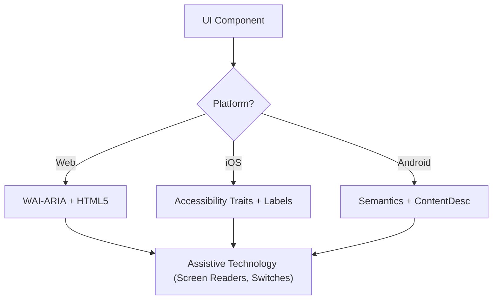

# Accessibility (WCAG 2.2)

Technical implementation of WCAG 2.2 success criteria so interfaces are Perceivable, Operable, Understandable, and Robust (POUR) — including for screen reader, switch control, and keyboard users.

## When to Use

- Defining UI component specifications for Web, iOS, or Android.
- Auditing existing code for accessibility barriers or compliance gaps.
- Implementing new WCAG 2.2 standards like Target Size (Minimum) and Focus Appearance.
- Mapping high-level design requirements to technical attributes (ARIA roles, traits, hints).

## Core Concepts

- **POUR Principles**: WCAG's foundation (Perceivable, Operable, Understandable, Robust).
- **Semantic Mapping**: native elements over generic containers for built-in accessibility.
- **Accessibility Tree**: the UI representation assistive technologies actually "read."
- **Focus Management**: order and visibility of the keyboard/screen reader cursor.
- **Labeling & Hints**: context via `aria-label`, `accessibilityLabel`, `contentDescription`.

## How It Works

### Step 1: Identify the Component Role

Determine the functional purpose (button, link, tab?). Prefer the most semantic native element before custom roles.

### Step 2: Define Perceivable Attributes

- Text contrast **4.5:1** (normal) or **3:1** (large/UI).
- Text alternatives for non-text content (images, icons).
- Responsive reflow up to 400% zoom without loss of function.

### Step 3: Implement Operable Controls

- Minimum **24x24 CSS pixel** target size (WCAG 2.2 SC 2.5.8).
- All interactive elements keyboard-reachable with a visible focus indicator (SC 2.4.11).
- Single-pointer alternatives for dragging movements.

### Step 4: Ensure Understandable Logic

- Consistent navigation patterns.
- Descriptive error messages with correction suggestions (SC 3.3.3).
- "Redundant Entry" (SC 3.3.7): never ask for the same data twice.

### Step 5: Verify Robust Compatibility

- Correct `Name, Role, Value` patterns.
- `aria-live` or live regions for dynamic status updates.

## Accessibility Architecture Diagram



## Cross-Platform Mapping

| Feature            | Web (HTML/ARIA)          | iOS (SwiftUI)                        | Android (Compose)                                           |
| :----------------- | :----------------------- | :----------------------------------- | :---------------------------------------------------------- |
| **Primary Label**  | `aria-label` / `<label>` | `.accessibilityLabel()`              | `contentDescription`                                        |
| **Secondary Hint** | `aria-describedby`       | `.accessibilityHint()`               | `Modifier.semantics { stateDescription = ... }`             |
| **Action Role**    | `role="button"`          | `.accessibilityAddTraits(.isButton)` | `Modifier.semantics { role = Role.Button }`                 |
| **Live Updates**   | `aria-live="polite"`     | `.accessibilityLiveRegion(.polite)`  | `Modifier.semantics { liveRegion = LiveRegionMode.Polite }` |

## Examples

### Web: Accessible Search

```html
<form role="search">
  <label for="search-input" class="sr-only">Search products</label>
  <input type="search" id="search-input" placeholder="Search..." />
  <button type="submit" aria-label="Submit Search">
    <svg aria-hidden="true">...</svg>
  </button>
</form>
```

### iOS: Accessible Action Button

```swift
Button(action: deleteItem) {
    Image(systemName: "trash")
}
.accessibilityLabel("Delete item")
.accessibilityHint("Permanently removes this item from your list")
.accessibilityAddTraits(.isButton)
```

### Android: Accessible Toggle

```kotlin
Switch(
    checked = isEnabled,
    onCheckedChange = { onToggle() },
    modifier = Modifier.semantics {
        contentDescription = "Enable notifications"
    }
)
```

## Anti-Patterns to Avoid

- **Div-Buttons**: `<div>`/`<span>` click handlers without a role and keyboard support.
- **Color-Only Meaning**: error or status indicated _only_ by a color change (e.g., red border).
- **Uncontained Modal Focus**: modals that don't trap focus, letting keyboard users reach background content. Focus must be contained _and_ escapable via the `Escape` key or an explicit close button (WCAG SC 2.1.2).
- **Redundant Alt Text**: "Image of..."/"Picture of..." in alt text — screen readers already announce the role "Image".

## Best Practices Checklist

- [ ] Interactive elements meet the **24x24px** (Web) or **44x44pt** (Native) target size.
- [ ] Focus indicators are clearly visible and high-contrast.
- [ ] Modals **contain focus** while open, and release it cleanly on close (`Escape` key or close button).
- [ ] Dropdowns and menus restore focus to the trigger element on close.
- [ ] Forms provide text-based error suggestions.
- [ ] All icon-only buttons have a descriptive text label.
- [ ] Content reflows properly when text is scaled.

## References

- [WCAG 2.2 Guidelines](https://www.w3.org/TR/WCAG22/)
- [WAI-ARIA Authoring Practices](https://www.w3.org/TR/wai-aria-practices/)
- [iOS Accessibility Programming Guide](https://developer.apple.com/documentation/accessibility)
- [iOS Human Interface Guidelines - Accessibility](https://developer.apple.com/design/human-interface-guidelines/accessibility)
- [Android Accessibility Developer Guide](https://developer.android.com/guide/topics/ui/accessibility)

## Related Skills

- `frontend-patterns`
- `design-system`
- `liquid-glass-design`
- `swiftui-patterns`
